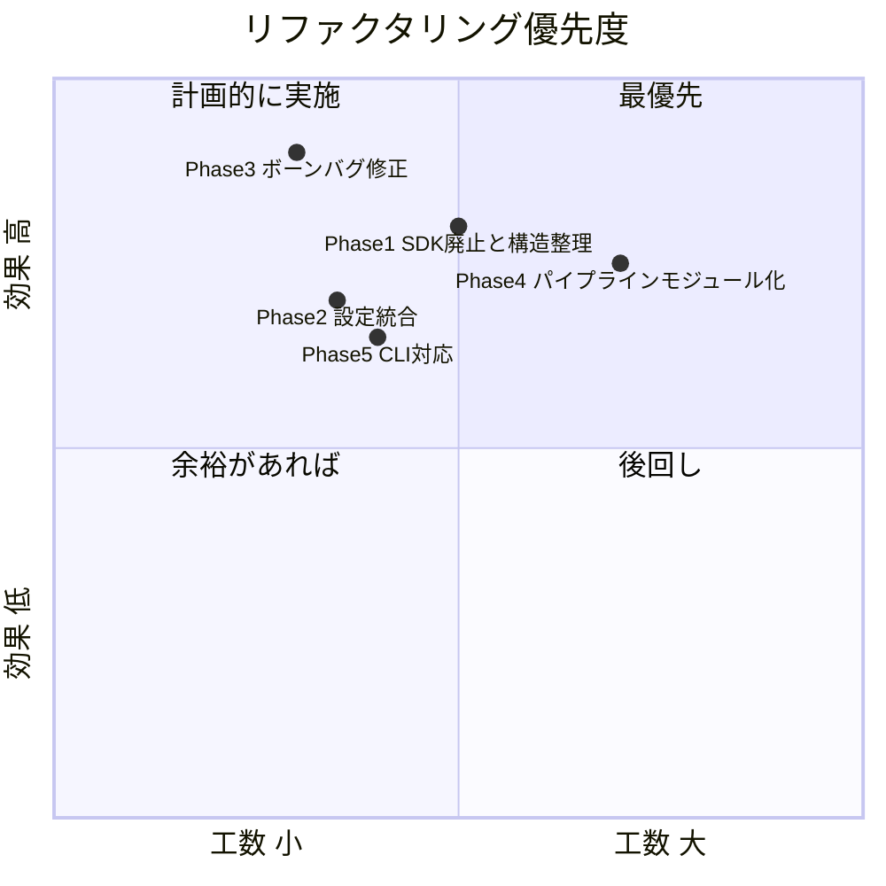

# ArrangeFBX リファクタリング提案

> **方針: Blender版（`blender_fbx_modifier.py`）への統合・一本化**
>
> Autodesk FBX SDK版（`fbx_modifier.py`）は廃止し、Blender版に機能を集約します。
> FBX SDKは別途インストールが必要で依存関係が重い一方、Blenderは無料かつFBXの読み書きを標準サポートしているため、メンテナンスコストを削減できます。

---

## 📋 現状分析

### プロジェクト構成
```
ArrangeFBX/
├── blender_fbx_modifier.py   # Blender用スクリプト（246行）← メイン
├── fbx_modifier.py            # Autodesk FBX SDK用スクリプト（118行）← 廃止対象
├── config.json                # 設定ファイル
├── testFBX/                   # テスト用FBXデータ
│   ├── female.fbx
│   ├── female_ue.fbx          # 出力結果
│   ├── bone_analysis.txt      # ボーン解析結果
│   └── *.bmp                  # テクスチャ
├── README.md
└── .gitignore
```

### 検出された問題点

| # | カテゴリ | 問題 | 深刻度 |
|---|---------|------|--------|
| 1 | **設計** | `fbx_modifier.py` が未使用のまま残存。役割分担が不明確 | 🔴 高 |
| 2 | **密結合** | `main()` が設定読込・インポート・ボーン解析・リネーム・サブディビジョン・エクスポートを全て担当（God Function） | 🔴 高 |
| 3 | **ハードコード** | 入出力パス（`female.fbx`, `female_ue.fbx`）がコード内に埋め込み | 🟡 中 |
| 4 | **自動推測の精度** | `guess_bone_mapping()` が重複マッピングを生成（例: `neck_01` が3つ、`clavicle_l` が2つ） | 🔴 高 |
| 5 | **拡張性** | 設定が `subdivision_level` のみで、ボーンマッピングや入出力パスは設定不可 | 🟡 中 |
| 6 | **エラーハンドリング** | 例外処理が不十分、ログ出力がprint文のみ | 🟡 中 |
| 7 | **テスト** | ユニットテストが存在しない | 🟡 中 |
| 8 | **CLI** | コマンドライン引数なし。ファイルを変えるにはコード修正が必要 | 🟡 中 |

### `fbx_modifier.py` 廃止の根拠

| 観点 | Blender版 | FBX SDK版 |
|------|-----------|-----------|
| 依存関係 | Blender本体のみ（無料） | Autodesk FBX SDK（別途インストール必要） |
| ボーン自動推測 | ✅ `guess_bone_mapping()` あり | ❌ 手動マッピングのみ |
| サブディビジョン | ✅ Blenderモディファイア使用 | ❌ 未対応 |
| スケール変換 | ✅ FBXエクスポート設定で対応 | ✅ `FbxSystemUnit` で対応 |
| メンテナンス性 | Blender APIの豊富なドキュメント | SDKのドキュメントが限定的 |

**結論**: Blender版がすべての機能を網羅しており、SDK版の独自機能はありません。SDK版を廃止してBlender版に一本化します。

---

## 🏗️ 提案するリファクタリング（全5 Phase）

### Phase 1: `fbx_modifier.py` の廃止とプロジェクト構造の整理

**目標**: SDK版を削除し、Blender版をモジュール分割

#### 1-1. `fbx_modifier.py` の廃止

```powershell
# SDK版を削除
git rm fbx_modifier.py
```

#### 1-2. 提案するディレクトリ構造

```
ArrangeFBX/
├── src/
│   ├── __init__.py
│   ├── config.py              # 設定管理クラス
│   ├── bone_mapper.py         # ボーンマッピング（手動辞書の適用）
│   ├── bone_guesser.py        # ボーン名自動推測アルゴリズム
│   ├── subdivision.py         # メッシュ細分化処理
│   ├── fbx_io.py              # FBXインポート/エクスポート（Blender bpy）
│   ├── scene_utils.py         # シーン操作ユーティリティ
│   └── logger.py              # ロギングユーティリティ
├── presets/
│   └── ue5_mannequin.json     # UE5標準マネキン用ボーンマッピング
├── tests/
│   ├── test_bone_mapper.py
│   ├── test_bone_guesser.py
│   └── test_config.py
├── blender_run.py             # Blender用エントリーポイント（旧 blender_fbx_modifier.py）
├── config.json
├── README.md
└── .gitignore
```

**変更のポイント**:
- `blender_fbx_modifier.py` → `blender_run.py`（エントリーポイントとして簡潔化）
- 各処理を `src/` 配下のモジュールに分離
- `fbx_modifier.py` は削除

---

### Phase 2: 設定管理の統合

**現在の `config.json`**（項目が少なすぎる）:
```json
{
    "subdivision_level": 1,
    "apply_subdivision_to_all_meshes": true
}
```

**提案する `config.json`**:
```json
{
    "input": {
        "fbx_path": "testFBX/female.fbx",
        "use_custom_normals": false
    },
    "output": {
        "fbx_path": "testFBX/female_ue.fbx",
        "analysis_path": "testFBX/bone_analysis.txt",
        "format": "fbx_binary"
    },
    "bone_mapping": {
        "preset": "presets/ue5_mannequin.json",
        "auto_guess_enabled": true,
        "side_detection_threshold": 0.05
    },
    "subdivision": {
        "level": 1,
        "apply_to_all_meshes": true
    },
    "export": {
        "global_scale": 1.0,
        "scale_options": "FBX_SCALE_ALL",
        "axis_forward": "-Z",
        "axis_up": "Y",
        "bake_anim": true,
        "add_leaf_bones": false,
        "mesh_smooth_type": "FACE"
    }
}
```

**設定管理クラスの実装**:

```python
# src/config.py
import json
import os

class Config:
    """設定ファイルの読み込みと管理"""
    
    DEFAULT_CONFIG = {
        "input": {"fbx_path": "", "use_custom_normals": False},
        "output": {"fbx_path": "", "analysis_path": "", "format": "fbx_binary"},
        "bone_mapping": {"preset": "", "auto_guess_enabled": True, "side_detection_threshold": 0.05},
        "subdivision": {"level": 0, "apply_to_all_meshes": True},
        "export": {
            "global_scale": 1.0, "scale_options": "FBX_SCALE_ALL",
            "axis_forward": "-Z", "axis_up": "Y",
            "bake_anim": True, "add_leaf_bones": False, "mesh_smooth_type": "FACE"
        }
    }
    
    def __init__(self, config_path: str, base_dir: str = ""):
        self.base_dir = base_dir
        self._data = self.DEFAULT_CONFIG.copy()
        if os.path.exists(config_path):
            with open(config_path, 'r', encoding='utf-8') as f:
                user_config = json.load(f)
                self._deep_update(self._data, user_config)
    
    def _deep_update(self, base: dict, update: dict):
        """ネストされた辞書を再帰的にマージ"""
        for key, val in update.items():
            if isinstance(val, dict) and key in base:
                self._deep_update(base[key], val)
            else:
                base[key] = val
    
    @property
    def input_path(self) -> str:
        return os.path.join(self.base_dir, self._data["input"]["fbx_path"])
    
    @property
    def output_path(self) -> str:
        return os.path.join(self.base_dir, self._data["output"]["fbx_path"])
    
    @property
    def subdivision_level(self) -> int:
        return self._data["subdivision"]["level"]
    
    @property
    def export_settings(self) -> dict:
        return self._data["export"]
    
    # ... その他プロパティ
```

---

### Phase 3: ボーンマッピングの改善（重複バグ修正）

> [!CAUTION]
> 現在の `guess_bone_mapping()` には**重複マッピングバグ**があります。
> `bone_analysis.txt` を見ると `neck_01` に3つ、`clavicle_l` に2つのボーンが割り当てられています。

#### 問題の根本原因

```python
# 現在のコード（blender_fbx_modifier.py 53-79行目）の問題:
# 1. 背骨チェーンのトラバース中に neck_01 への上書きが複数回発生
# 2. 腕の判定ループで parent_name_mapped が "neck" を含む場合、
#    複数の子ボーンが clavicle として再マッピングされる
# 3. 同じターゲット名（例: clavicle_l）が複数のソースボーンに割り当て可能
```

#### 提案する改善

```python
# src/bone_guesser.py

class BoneGuesser:
    """ヒューリスティックに基づくボーン名自動推測器（Blender bpy専用）"""
    
    def __init__(self, armature_obj, threshold_x=0.05):
        self.armature = armature_obj
        self.threshold_x = threshold_x
        self._mapping = {}
        self._assigned_targets = set()  # 重複防止: 既に割り当てたUEボーン名を記録
    
    def _assign(self, original_name: str, target_name: str) -> bool:
        """重複を防止しながらマッピングを登録。割り当て済みならFalseを返す"""
        if target_name in self._assigned_targets:
            return False
        self._mapping[original_name] = target_name
        self._assigned_targets.add(target_name)
        return True
    
    def guess(self) -> dict:
        """ボーンマッピングを推測して辞書を返す"""
        bones = self.armature.data.bones
        
        # ルートの特定
        root_bones = [b for b in bones if b.parent is None]
        if not root_bones:
            return {}
        
        root = root_bones[0]
        self._assign(root.name, "root")
        
        # 骨盤の特定
        if not root.children:
            return self._mapping.copy()
        
        pelvis = root.children[0]
        self._assign(pelvis.name, "pelvis")
        
        # 背骨チェーンの特定
        self._trace_spine_chain(pelvis)
        
        # 脚の特定（骨盤の左右の子）
        self._identify_legs(pelvis)
        
        # 腕の特定（胸/首付近からの左右の分岐）
        self._identify_arms()
        
        return self._mapping.copy()
    
    def _is_center(self, bone) -> bool:
        """ボーンがセンターライン上にあるか判定"""
        return abs(bone.head_local.x) < self.threshold_x
    
    def _get_side(self, bone) -> str:
        """ボーンの左右を判定"""
        return "_l" if bone.head_local.x > 0 else "_r"
    
    def _trace_spine_chain(self, pelvis):
        """骨盤から上方に背骨チェーンをたどる"""
        current = pelvis
        spine_index = 1
        
        while current.children:
            center_children = [c for c in current.children if self._is_center(c)]
            if not center_children:
                break
            
            next_bone = center_children[0]
            
            # 末端（子なし）= 頭
            if not next_bone.children:
                self._assign(next_bone.name, "head")
                # 現在のボーンが spine_XX ならneckに修正
                if current.name in self._mapping and self._mapping[current.name].startswith("spine"):
                    old_target = self._mapping[current.name]
                    self._assigned_targets.discard(old_target)
                    self._assign(current.name, "neck_01")
                break
            
            # センターの子が1つだけ → まだ背骨
            center_grandchildren = [c for c in next_bone.children if self._is_center(c)]
            side_children = [c for c in next_bone.children if not self._is_center(c)]
            
            if side_children:
                # 分岐がある → ここが首（腕の付け根の上）
                self._assign(next_bone.name, "neck_01")
                # 首の先にセンターの子があれば頭
                if center_grandchildren:
                    head_bone = center_grandchildren[0]
                    self._assign(head_bone.name, "head")
                break
            else:
                self._assign(next_bone.name, f"spine_{spine_index:02d}")
                spine_index += 1
            
            current = next_bone
    
    def _identify_legs(self, pelvis):
        """骨盤から左右に伸びる脚を特定"""
        for child in pelvis.children:
            if self._is_center(child):
                continue  # 背骨方向はスキップ
            
            side = self._get_side(child)
            self._assign(child.name, f"thigh{side}")
            
            # 膝
            if child.children:
                calf = child.children[0]
                self._assign(calf.name, f"calf{side}")
                # 足首
                if calf.children:
                    foot = calf.children[0]
                    self._assign(foot.name, f"foot{side}")
    
    def _identify_arms(self):
        """背骨/首からの左右の分岐を腕として特定"""
        for original_name, target_name in list(self._mapping.items()):
            if not (target_name.startswith("spine") or target_name == "neck_01"):
                continue
            
            # 元のボーンオブジェクトを取得
            bone = self.armature.data.bones.get(original_name)
            if bone is None:
                continue
            
            for child in bone.children:
                if child.name in self._mapping:
                    continue  # 既にマッピング済み
                if self._is_center(child):
                    continue  # センターラインはスキップ
                
                side = self._get_side(child)
                self._assign(child.name, f"clavicle{side}")
                
                # 上腕 → 前腕 → 手
                if child.children:
                    upperarm = child.children[0]
                    self._assign(upperarm.name, f"upperarm{side}")
                    if upperarm.children:
                        lowerarm = upperarm.children[0]
                        self._assign(lowerarm.name, f"lowerarm{side}")
                        if lowerarm.children:
                            hand = lowerarm.children[0]
                            self._assign(hand.name, f"hand{side}")
```

**主な改善ポイント**:
- `_assigned_targets` セットで**重複マッピング完全防止**
- 責務ごとにメソッド分割（`_trace_spine_chain`, `_identify_legs`, `_identify_arms`）
- `_is_center()`, `_get_side()` による判定ロジックの共通化
- `threshold_x` をパラメータ化（設定ファイルから注入可能）

---

### Phase 4: パイプライン設計

```python
# src/fbx_io.py
import bpy

def clear_scene():
    """Blenderシーンを初期化"""
    bpy.ops.object.select_all(action='SELECT')
    bpy.ops.object.delete()
    for col in [bpy.data.meshes, bpy.data.armatures, bpy.data.materials, bpy.data.images, bpy.data.actions]:
        for item in col:
            col.remove(item)

def import_fbx(filepath: str, use_custom_normals: bool = False):
    """FBXファイルをインポート"""
    bpy.ops.import_scene.fbx(filepath=filepath, use_custom_normals=use_custom_normals)

def find_armature():
    """シーン内のアーマチュアオブジェクトを検索"""
    for obj in bpy.data.objects:
        if obj.type == 'ARMATURE':
            return obj
    return None

def export_fbx(filepath: str, settings: dict):
    """FBXファイルをエクスポート"""
    bpy.ops.export_scene.fbx(
        filepath=filepath,
        use_selection=False,
        global_scale=settings.get("global_scale", 1.0),
        apply_scale_options=settings.get("scale_options", "FBX_SCALE_ALL"),
        axis_forward=settings.get("axis_forward", "-Z"),
        axis_up=settings.get("axis_up", "Y"),
        bake_anim=settings.get("bake_anim", True),
        bake_anim_use_all_bones=True,
        add_leaf_bones=settings.get("add_leaf_bones", False),
        mesh_smooth_type=settings.get("mesh_smooth_type", "FACE"),
    )
```

```python
# src/subdivision.py
import bpy

def apply_subdivision(level: int, apply_to_all: bool = True):
    """メッシュにサブディビジョンモディファイアを適用"""
    if level <= 0:
        return
    
    for obj in bpy.data.objects:
        if obj.type == 'MESH':
            subsurf = obj.modifiers.new(name="Subdivision", type='SUBSURF')
            subsurf.levels = level
            subsurf.render_levels = level
            if not apply_to_all:
                break  # 最初のメッシュのみ
```

```python
# src/bone_mapper.py
import bpy
import json
import os

def load_preset(preset_path: str) -> dict:
    """プリセットファイルからボーンマッピング辞書を読み込み"""
    if not preset_path or not os.path.exists(preset_path):
        return {}
    with open(preset_path, 'r', encoding='utf-8') as f:
        return json.load(f)

def rename_bones(armature_obj, mapping: dict) -> list:
    """マッピング辞書に基づきボーンをリネーム。変更ログのリストを返す"""
    log = []
    
    bpy.context.view_layer.objects.active = armature_obj
    bpy.ops.object.mode_set(mode='EDIT')
    
    for bone in armature_obj.data.edit_bones:
        if bone.name in mapping:
            old_name = bone.name
            new_name = mapping[old_name]
            bone.name = new_name
            log.append(f"{old_name} -> {new_name}")
        else:
            log.append(bone.name)
    
    bpy.ops.object.mode_set(mode='OBJECT')
    return log

def save_analysis(log: list, output_path: str):
    """ボーン解析結果をファイルに出力"""
    with open(output_path, "w", encoding="utf-8") as f:
        f.write("FBX Bone Analysis Result\n")
        f.write("========================\n")
        for entry in sorted(log):
            f.write(f"- {entry}\n")
```

```python
# blender_run.py （エントリーポイント）
import bpy
import sys
import os

def get_script_dir():
    for arg in sys.argv:
        if arg.endswith('.py'):
            return os.path.dirname(os.path.abspath(arg))
    return os.getcwd()

def setup_paths():
    """src/ をインポートパスに追加"""
    script_dir = get_script_dir()
    src_dir = os.path.join(script_dir, "src")
    if src_dir not in sys.path:
        sys.path.insert(0, src_dir)
    return script_dir

def patch_blender_compat():
    """Blender 4.1+の互換性パッチ"""
    for attr in ['create_normals_split', 'calc_normals_split', 'free_normals_split']:
        if not hasattr(bpy.types.Mesh, attr):
            setattr(bpy.types.Mesh, attr, lambda self: None)

def main():
    script_dir = setup_paths()
    
    from config import Config
    from fbx_io import clear_scene, import_fbx, find_armature, export_fbx
    from bone_guesser import BoneGuesser
    from bone_mapper import load_preset, rename_bones, save_analysis
    from subdivision import apply_subdivision
    
    # 設定読み込み
    config = Config(os.path.join(script_dir, "config.json"), base_dir=script_dir)
    
    # CLI引数の上書き処理
    args = parse_cli_args()
    if args.get("input"):
        config.override_input(args["input"])
    if args.get("output"):
        config.override_output(args["output"])
    
    patch_blender_compat()
    
    print("--- FBX Processing Started (Blender) ---")
    
    # 1. シーンクリア & インポート
    clear_scene()
    import_fbx(config.input_path, config.use_custom_normals)
    
    # 2. アーマチュア検索
    armature = find_armature()
    if armature is None:
        print("ERROR: アーマチュアが見つかりません")
        return
    
    # 3. ボーンマッピング（自動推測 + プリセット上書き）
    guesser = BoneGuesser(armature, config.side_threshold)
    mapping = guesser.guess()
    
    preset = load_preset(config.preset_path)
    mapping.update(preset)  # プリセットで上書き
    
    # 4. ボーンリネーム & 解析出力
    log = rename_bones(armature, mapping)
    save_analysis(log, config.analysis_path)
    
    # 5. サブディビジョン
    apply_subdivision(config.subdivision_level, config.apply_to_all_meshes)
    
    # 6. エクスポート
    export_fbx(config.output_path, config.export_settings)
    
    print(f"完了: {config.output_path}")

def parse_cli_args() -> dict:
    """Blender実行時の -- 以降のCLI引数を解析"""
    result = {}
    argv = sys.argv
    if "--" in argv:
        custom_args = argv[argv.index("--") + 1:]
        i = 0
        while i < len(custom_args):
            if custom_args[i] in ("-i", "--input") and i + 1 < len(custom_args):
                result["input"] = custom_args[i + 1]
                i += 2
            elif custom_args[i] in ("-o", "--output") and i + 1 < len(custom_args):
                result["output"] = custom_args[i + 1]
                i += 2
            elif custom_args[i] == "--dry-run":
                result["dry_run"] = True
                i += 1
            else:
                i += 1
    return result

if __name__ == "__main__":
    main()
```

---

### Phase 5: CLI対応とREADME更新

#### CLI実行例

```powershell
# 基本実行（config.json の設定を使用）
& blender.exe --background --python blender_run.py

# 入出力ファイルを指定
& blender.exe --background --python blender_run.py -- -i mymodel.fbx -o mymodel_ue.fbx

# 解析のみ（エクスポートなし）
& blender.exe --background --python blender_run.py -- --dry-run
```

#### README.md の更新内容

- `fbx_modifier.py` への言及を削除
- 新しいディレクトリ構造を反映
- CLI引数の使い方を追記
- プリセットの使い方を追記

---

## 📊 優先度マトリクス



## 🎯 推奨実施順序

| 順序 | Phase | 内容 | 工数目安 |
|------|-------|------|----------|
| **1** | Phase 1 | `fbx_modifier.py` 削除 + ディレクトリ構造の再編成 | 1〜2時間 |
| **2** | Phase 3 | ボーンマッピングの重複バグ修正（`BoneGuesser` クラス化） | 1〜2時間 |
| **3** | Phase 2 | `config.json` の拡張（`Config` クラス導入） | 1時間 |
| **4** | Phase 4 | 処理のモジュール分割（`fbx_io`, `bone_mapper`, `subdivision`） | 2〜3時間 |
| **5** | Phase 5 | CLI引数対応 + README更新 | 1時間 |

> [!TIP]
> Phase 1〜3 だけでも実施すれば、コードの品質と使い勝手が大幅に向上します。
> 全Phaseの合計工数は **6〜9時間** 程度です。

---

どのPhaseから着手しますか？
